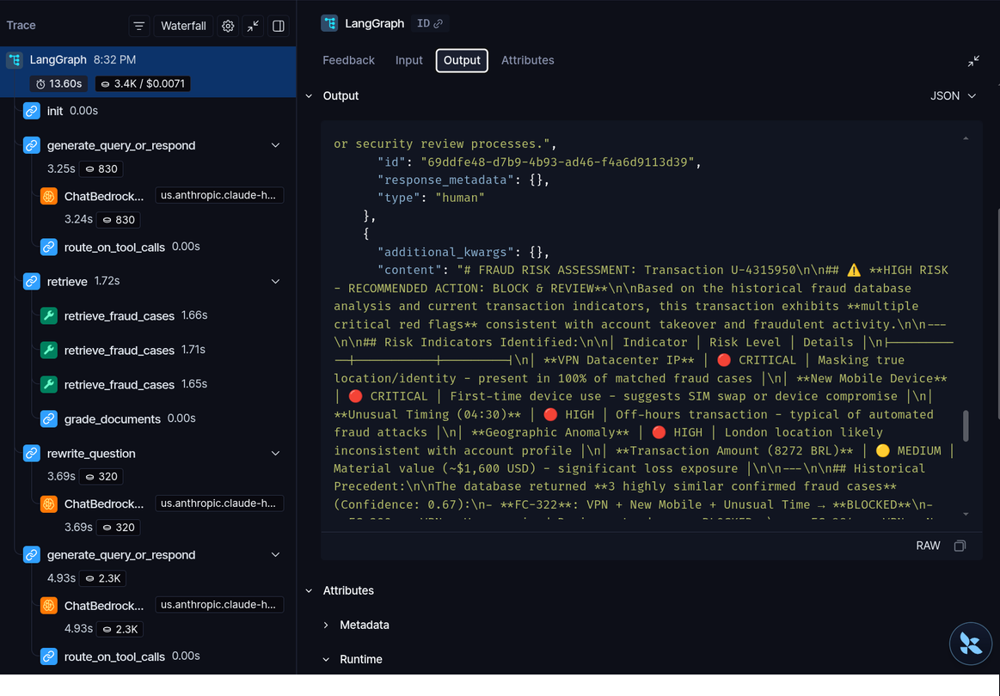
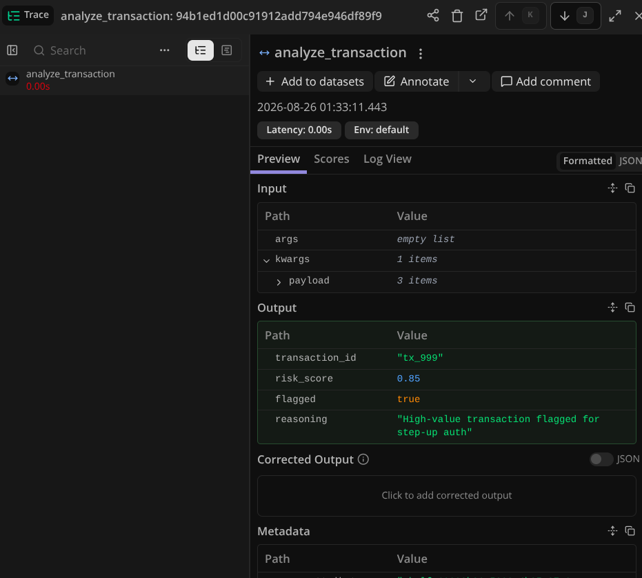

# LangSmith vs. Langfuse Comparison

This document provides a technical comparison between **LangSmith** and **Langfuse**, focusing on workflow transparency, step-by-step execution tracing, and cost-versus-latency tracking.

---

## 1. Overview & Core Philosophy

When building and scaling production LLM applications and agents, selecting the right observability tool depends heavily on your workflow transparency requirements and infrastructure strategy:

* **LangSmith** excels in deep agentic workflow transparency, offering a granular, step-by-step execution graph (such as tracking nodes from initialization through retrieval, document grading, and tool routing).
* **Langfuse** shines in framework-agnostic tracking, unit-based cost monitoring, and providing robust analytics for latency and token spend at every execution step.

<!-- > **Langsmith Trace Evidence:**  -->
### Visual Evidence: LangSmith Agentic Graph Transparency 

---

## 2. Feature-by-Feature Comparison

| Dimension | LangSmith | Langfuse |
| --- | --- | --- |
| **Workflow Transparency** | Deep step-by-step agent execution trees (ideal for complex multi-turn workflows and LangGraph). | Clean trace views focusing on inputs, outputs, metadata, and core functional spans. |
| **Cost & Latency Tracking** | Tracks run costs and token usage alongside execution paths. | Highly optimized for granular cost monitoring, latency metrics, and usage-based analytics at each step. |
| **Deployment & Ownership** | Proprietary SaaS platform with hybrid/enterprise self-hosting options. | Open-source core (MIT) with flexible self-hosting (ClickHouse backend) or managed cloud. |
| **Pricing Model** | Seat-based plus tier-based trace retention. | Usage/unit-based (traces, observations, and scores) with unlimited seats on paid tiers. |

<!-- > **Langfuse Trace Evidence (Cloud Run):**  -->
### Visual Evidence: Langfuse Cloud Run Payload & Latency Trace

---

## 3. Key Trade-Offs: Workflow Steps vs. Cost Monitoring

### LangSmith: Workflow Steps & Transparency

* **Granular Graph Visualization:** As seen in complex agentic setups (e.g., Retrieval-Augmented Generation loops), LangSmith explicitly maps out individual tool nodes, retriever calls, document grading steps, and LLM reasoning loops.
* **Debugging Complex Chains:** Ideal for developers who need to inspect state mutations, intermediate tool outputs, and prompt variations sequentially to isolate failures.

### Langfuse: Cost & Latency Focus

* **Efficient Lightweight Tracing:** Captures function inputs, outputs, user IDs, and custom metadata (such as fraud analysis risk scores and payloads) with minimal friction.
* **Cost-Centric Insights:** Well-suited for tracking token expenditure and latency metrics across microservices deployed on cloud environments like Google Cloud Run.
* **Data Control:** Provides an open-source option for teams requiring full data ownership and zero software license fees for self-hosted instances.

---

## Summary Verdict

* **Choose LangSmith** if your architecture relies heavily on complex multi-step agents or graph-based frameworks, and you require exhaustive step-by-step visibility into every execution phase.
* **Choose Langfuse** if your priority is lightweight integration, robust cost monitoring, framework neutrality, and open-source data ownership.